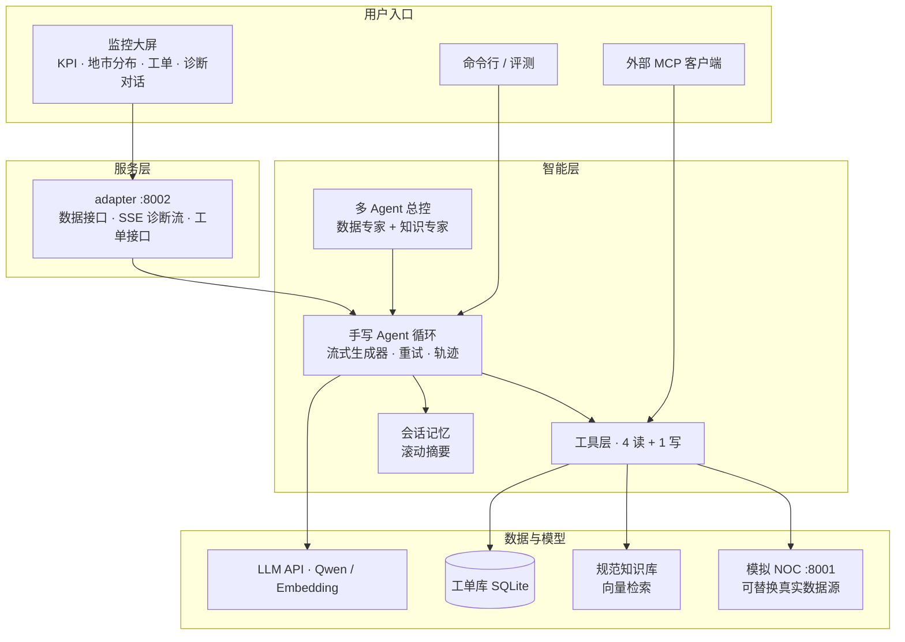

# Telecom NOC Agent

[](https://github.com/fairywww/telecom-noc-agent/actions/workflows/ci.yml)


面向通信网络运维（NOC）的智能运维 Agent：实时监控大屏、自然语言故障诊断、规范知识库检索、受控的工单自动生成。Agent 循环为手写实现（不依赖框架），全链路可解释、可测试、可评测。

**A domain-pluggable AI agent for network operations — hand-written agent loop, RAG, MCP server, and guarded write-actions.**

## 特性

- **智能诊断**：自然语言提问 → Agent 自主选择工具取数 → 结合规范知识库 → 结论附数据依据与规范出处
- **全程可解释**：SSE 实时推送工具调用轨迹，答案逐字流式渲染——每个结论都能看到"它查了什么"
- **多轮记忆**：滚动摘要 + 近期原文两段式会话记忆，token 成本不随对话长度膨胀
- **受控写操作**：工单自动生成经三道防线（提示词意图门 / 存储层幂等 / 审计字段），实测不越权、不重复
- **多 Agent 编排**：总控 + 领域专家子 Agent（Agent as Tool），附单/多 Agent 实测成本对比数据
- **MCP Server**：手写 JSON-RPC/stdio 协议实现，任何 MCP 客户端可直接发现并调用全部工具
- **质量内建**：16 项零网络单元测试（CI 自动运行）、4 类场景评测集（成功率 / 轮数 / 时延 / 词元）
- **双实现对照**：同一 Agent 的手写版与 LangGraph 版并存，行为一致，逐概念对照文档

## 架构



## 快速开始

```bash
git clone https://github.com/fairywww/telecom-noc-agent.git
cd telecom-noc-agent
python3 -m venv .venv && source .venv/bin/activate
make install                       # 或 pip install -r requirements.txt -r requirements-dev.txt
cp .env.example .env               # 填入 LLM_API_KEY（ModelScope 免费额度即可）

make run-noc                       # 终端 1：python3 -m uvicorn noc_agent.server.noc_mock:app --port 8001
make run-adapter                   # 终端 2：python3 -m uvicorn noc_agent.server.adapter:app --port 8002
```

浏览器打开 http://localhost:8002 。未配置密钥时数据大屏正常工作，仅智能诊断需要 LLM。

Docker 一键启动：

```bash
docker compose up --build
```

命令行使用：

```bash
python3 -m noc_agent.agent.loop "南京退服全网最多，按规范该怎么处置？"       # 单次诊断
python3 -m noc_agent.agent.memory                                           # 多轮对话
python3 -m noc_agent.agent.orchestrator "南京情况多严重？按规范怎么处置？"   # 多 Agent 编排
```

## 项目结构

```
telecom-noc-agent/
├── noc_agent/                  # 主包
│   ├── config.py               #   路径与环境变量（.env 注入）
│   ├── llm.py                  #   OpenAI 兼容 LLM 客户端（流式、推理模型）
│   ├── agent/
│   │   ├── loop.py             #   手写 Agent 循环（单一流式生成器）
│   │   ├── tools.py            #   工具层：4 读 + 1 写，循环与 MCP 共用
│   │   ├── memory.py           #   多轮会话与滚动摘要记忆
│   │   └── orchestrator.py     #   总控 + 专家子 Agent 编排
│   ├── rag/retrieval.py        #   RAG：切分 / Embedding / 余弦检索
│   ├── server/
│   │   ├── noc_mock.py         #   模拟 NOC 数据源（对接真实系统时整体替换）
│   │   └── adapter.py          #   大屏后端：数据接口 / SSE 诊断流 / 工单接口
│   ├── storage/tickets.py      #   工单存储：SQLite、幂等保护、审计字段
│   └── mcp/server.py           #   手写 MCP Server（JSON-RPC 2.0 / stdio）
├── web/index.html              # 监控大屏（原生 HTML/JS，零前端依赖）
├── examples/                   # LangGraph 对照实现、MCP 客户端演示
├── eval.py                     # Agent 评测集
├── prompts/                    # 提示词：人设与行为规则
├── data/knowledge/             # 运维规范知识库（演示文档，自编通用内容）
├── notes/                      # 19 篇技术笔记（按六阶段知识地图组织）
└── tests/                      # 17 项单元测试（零网络依赖）
```

## 质量保障

```bash
make test    # 17 项单元测试：契约、聚合、切分、幂等、MCP 协议、记忆压缩（3s，零网络）
make eval    # 评测集：4 类场景的成功率 / 轮数 / 时延 / 词元（需服务运行）
```

- CI（GitHub Actions）在 Python 3.9 / 3.11 上自动运行全部测试
- 评测集曾在首次运行时定位到一处可复现的上游缺陷（空 choices 应答），修复后回归通过——评测方法见 [notes/05-agent-platform/agent-eval.md](notes/05-agent-platform/agent-eval.md)

## 设计原则

1. **先手写、后框架**：Agent 循环、MCP 协议、RAG 检索均为手写实现，每个机制可指认到行；LangGraph 版仅作对照
2. **错误是数据**：工具失败、未知工具、非法参数一律回填给模型自纠，而非抛异常中断
3. **越硬的保证放越深的层**：防重复建单靠存储层幂等，不靠提示词
4. **代码与配置分离**：密钥、地址、模型选择全部环境注入，本机 / Docker / 生产零改码切换
5. **领域可插拔**：工具函数、知识文档、提示词、面板为领域件，其余骨架领域无关——替换四者即可迁移至 IT 运维、电力、制造等"监控数据 + 制度规范 + 处置动作"场景

## 技术文档

[notes/](notes/) 收录 19 篇技术笔记，按六阶段知识地图组织（FastAPI 基础 → LLM 接入 → RAG → Agent 核心 → 平台能力 → 行业场景），每篇均锚定本仓库真实代码与实测数据，含设计取舍与自测题。入口：[notes/README.md](notes/README.md)

## Roadmap

- 工单状态流转（待处理 → 处理中 → 已销障）与高危操作人工审批门
- 真实 NOC 数据源对接（适配层方案已就绪）
- 知识库规模化：Milvus / 重排序 / 相关度阈值
- 网络优化建议场景

版本历史见 [CHANGELOG.md](CHANGELOG.md)。

## License

[MIT](LICENSE)
